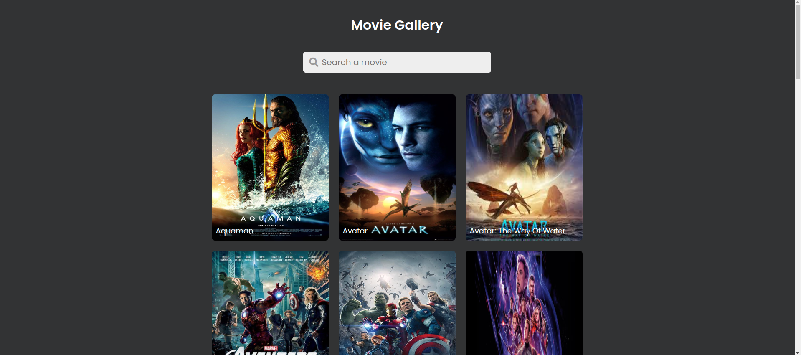

# Search Movies

## Project definition

> This simple project aims to develop a user-friendly page that allows users to
> search for movies. It provide user a simple search interface where users can
> enter movie titles or keywords. Upon submitting a search query, the
> application will fetch data from a gallery and display relevant results to the
> user.

## Table of contents

- [Search Movies](#search-movies)
  - [Project definition](#project-definition)
  - [Table of contents](#table-of-contents)
  - [General info](#general-info)
  - [Screenshots](#screenshots)
  - [Technologies](#technologies)
  - [Setup](#setup)
  - [Code Examples](#code-examples)
  - [Features](#features)
  - [Status](#status)

## General info

> The objective of the project is to practice separation of concern in
> JavaScript.

## Screenshots



## Technologies

- JavaScript
- HTML5
- CSS3
- VSC code
- Jest

## Setup

Create a new repo from the template

1. Clone the repo from your GitHub account
   > git clone `HTTPS link`
2. Open Visual Studio Code
3. Run npm i
4. Open index.html

## Code Examples

```js
const data = {
	images: [
		{
			id: 1,
			dataName: 'aquaman',
			src: '../assets/aquaman.jpg',
			title: 'Aquaman',
		},
	],
};
```

## Features

- Display Movie gallery: Show a list of movies along with their title.
- Searching: Allow users to search the movie based on title
- Images: Include posters of the movies.

To-do list:

- Start by defining the HTML structure for search movies.
- Style the posters using CSS.
- Separating concerns in this way, to have a clear structure, making code easier
  to understand, maintain, and expand upon. It's a great approach for building scalable and maintainable page

## Status

Project is: completed
